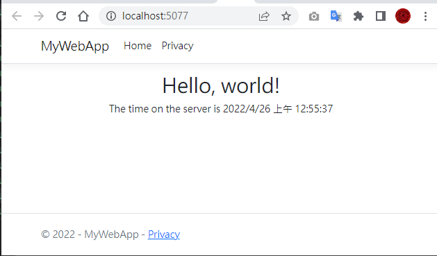

# Hello World in 5 minutes

### Download and install
- install .NET 6 SDK
- Check everything installed correctly
    Command prompt
    ```
    > dotnet 
    ```
- If the installation succeeded,


- ok, down.

### Create your app

- Command prompt
```
> dotnet new webapp -o MyWebApp --no-https -f net6.0
```

### Run your app

- 
```
> cd MyWebApp
```
- 
```
> dotnet watch
```
- ok


### Edit your code

- 修改 index.cshtml


### END